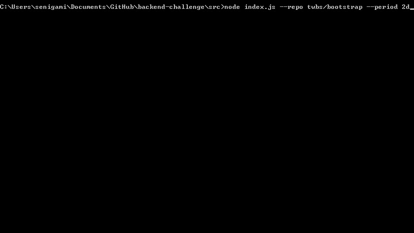

# github-count

get counts for comments and commits on github and display output

## Installation
* create `src/token/__do-not-commit-me__.js` file and add your github token there

## Usage
* `--repo` — the owner/repo to scan. ex: twbs/bootstrap
* `--period` — optional days back to scan. ex: 20d

Node console:

```
node index.js --repo twbs/bootstrap --period 2d
```

## Live Example


## License

[The MIT License](https://raw.githubusercontent.com/paulmillr/mit/master/README.md)
